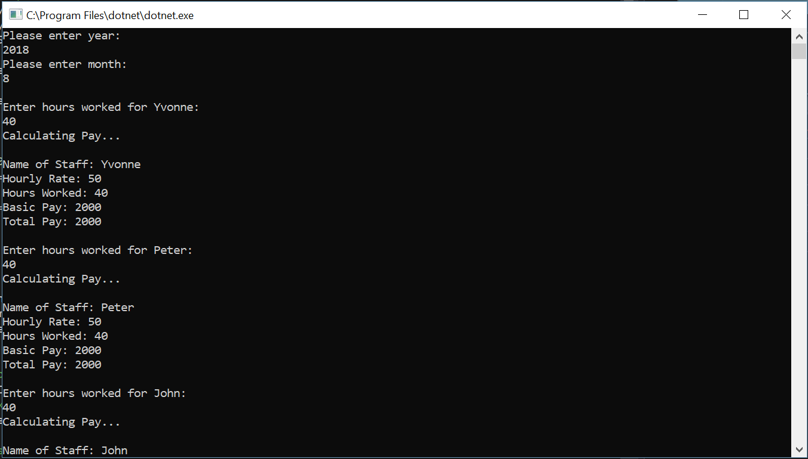
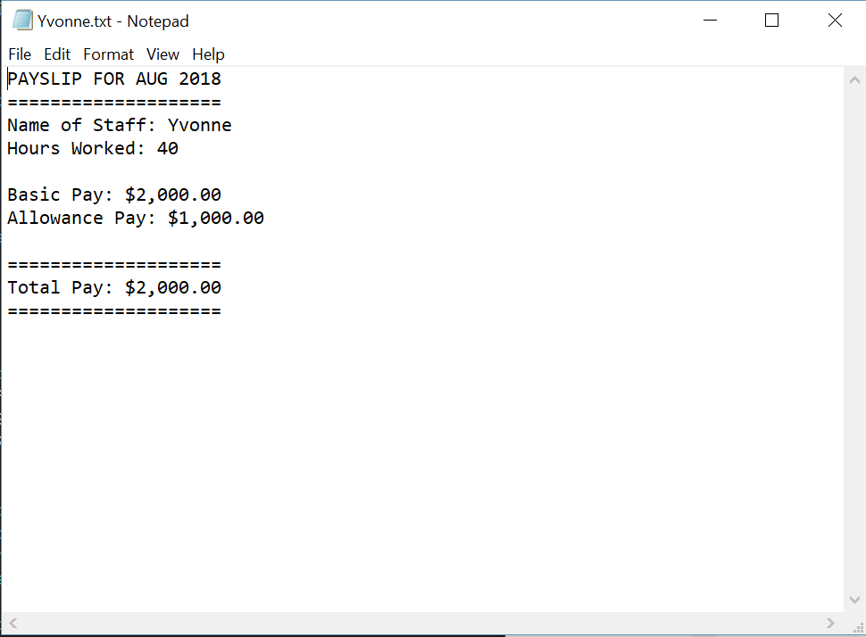

# CSProject
Payroll console app project at the end of "Learn C# in One Day and Learn it Well".

This is a simple program with five classes that takes in a text file and calculates pay for employees.

At the end of the program, payslips are generated for the employees listed in the text file.

